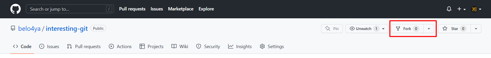

# Git Фишки - Хочу Знать #84

**Что?** Рассмотрим андеграундные команды и возможности git, которые, скорее всего, вам не придется использовать в своем рабочем процессе каждый день.

**Зачем?** Это интересно. Зная о возможности вы обязательно найдете ей применение. Эти знания повышают вашу квалификацию до опытного пользователя git.

**Сколько?** ~30 мин.

## План

- [смотрю я в стекляшку зеленого цвета...](https://github.com/belo4ya/interesting-git/tree/01-pretty)
- [вишневый десерт](https://github.com/belo4ya/interesting-git/tree/02-cherry-pick)
- [заметаем следы](https://github.com/belo4ya/interesting-git/tree/03-filter-branch)
- [экспелиармус, авада кедавра, акцио, rebase](https://github.com/belo4ya/interesting-git/tree/04-rebase-magic)
- [кажется, что за нами следят...](https://github.com/belo4ya/interesting-git/tree/05-hooks)
- [если это попадет не в те руки...](https://github.com/belo4ya/interesting-git/tree/06-cheating)

## Начать

Создать Fork репозитория:



Склонировать ваш Fork:

```
git clone https://github.com/<your-GitHub-username>/interesting-git.git
```

Открыть директорию interesting-git в текстовом редакторе и терминале 
(предпочтительно использовать текстовый редактор с встроенным терминалом, например, IDE от JetBrains или VSCode)

Ознакомиться со списком доступных веток:

```
git branch –a
```
